## Hi there 👋
A Java developer in constant search of the perfect "Flow State".

I came to development from a teaching background, and this has become my strength. Where others simply write code, I can structure chaos, explain complex architectural decisions, and focus on detail. My goal is not just working code, but elegant, maintainable solutions that adhere to SOLID principles and GoF patterns.

I am deeply immersed in the Java 21 and Spring Boot ecosystem. What drives me most in my work is the moment when complex business logic is transformed into a clear algorithm—that very "flow state" that makes me open my IDE every day.

🛠 My tech stack:\
Backend: Java 21 (Core, Multithreading), Spring (Boot, Data JPA, MVC, Security), Hibernate, REST API, Servlets.\
Testing: JUnit, Mockito, Testcontainers (I believe in the power of tests!).\
Infrastructure & Tools: SQL (PostgreSQL, MySQL), Docker, Maven, Git, Linux.\
Frontend Basics: HTML, CSS.

I'm looking for a team that values ​​code quality as much as I do and is willing to invest in a driven Junior developer. If you're looking for someone who can both write code and be responsible for it, we should definitely talk.

I'm looking for new connections and professional networking.

"Make it so. Engage!" 🖖

<h3 align="left">Languages and Tools:</h3>

    
    
    
    
    
    
    
    
    
    
    
    
    

<!--
**Nejert/Nejert** is a ✨ _special_ ✨ repository because its `README.md` (this file) appears on your GitHub profile.

Here are some ideas to get you started:

- 🔭 I’m currently working on ...
- 🌱 I’m currently learning ...
- 👯 I’m looking to collaborate on ...
- 🤔 I’m looking for help with ...
- 💬 Ask me about ...
- 📫 How to reach me: ...
- 😄 Pronouns: ...
- ⚡ Fun fact: ...
-->
